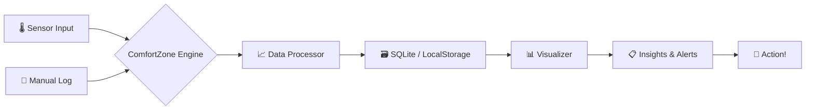

╔══════════════════════════════════════════════════════════════════════════╗
║  ██████  ██████  ███    ███ ███████  ██████  ██████  ████████ ███████  ║
║ ██      ██    ██ ████  ████ ██      ██    ██ ██   ██    ██    ██       ║
║ ██      ██    ██ ██ ████ ██ █████   ██    ██ ██████     ██    █████    ║
║ ██      ██    ██ ██  ██  ██ ██      ██    ██ ██   ██    ██    ██       ║
║  ██████  ██████  ██      ██ ██       ██████  ██   ██    ██    ███████  ║
║  ██████  ██████  ██      ██ ██       ██████  ██   ██    ██    ███████  ║
║ ██      ██    ██ ██      ██ ██      ██    ██ ██   ██    ██         ██  ║
║ ██      ██    ██ ██      ██ ███████ ██    ██ ██████     ██    ███████  ║
╚══════════════════════════════════════════════════════════════════════════╝
                    ░░░░░░░░░░ comfortzone ░░░░░░░░░░
          Personal Comfort Zone Tracker — Python / JavaScript

[](https://github.com/shubhyagami/comfortzone)
[](LICENSE)
[](https://github.com/shubhyagami/comfortzone)


---

## 🔥 What Is This?

**ComfortZone** is your personal sanctuary of data – a hybrid Python/JS toolkit that tracks, visualises, and nudges you toward your ideal comfort metrics. Whether it's room temperature, ambient noise, humidity, or your subjective mood, ComfortZone turns raw sensor readings into actionable insights. Stop guessing – start thriving.

> “Your comfort zone is not a cage – it’s a dashboard.”

---

## ✨ Features

| Icon | Feature | Description |
|------|---------|-------------|
| 🌡️ | **Temperature Tracking** | Record ambient and skin‑temp from sensors or manual input |
| 😌 | **Mood Logging** | Tag your emotional state alongside physical data |
| 📊 | **Analytics Dashboard** | Real‑time charts & historical trends (matplotlib / Chart.js) |
| 🔔 | **Smart Alerts** | Get pinged when conditions drift outside your sweet spot |
| 🧩 | **Plugin System** | Extend with new sensors or export formats (JSON, CSV, PDF) |
| 🌐 | **Cross‑Platform** | CLI (Python) + Web UI (JS/React) – pick your weapon |

---

## 🧠 How It Works



1. **Input** – Connect a DHT22 / BMP280 sensor or type your data via the CLI/UI.
2. **Process** – The engine cleans, timestamps, and enriches readings.
3. **Store** – All history lands in a lightweight database (SQLite for Python, LocalStorage for JS).
4. **Visualize** – See your comfort zone morph over time with line charts and heatmaps.
5. **Act** – Get notifications when it’s time to open a window, grab a blanket, or just breathe.

---

## 📦 Installation

### Python (CLI + backend)

```bash
git clone https://github.com/shubhyagami/comfortzone.git
cd comfortzone
pip install -r requirements.txt
python comfort.py --init
```

### JavaScript (Web UI)

```bash
cd comfortzone/web
npm install
npm start
```

That’s it. The web UI will launch at `http://localhost:3000`.

---

## 🎯 Quick Start

```bash
# Record a temperature reading
python comfort.py log --temp 22.5 --humidity 45 --mood "focused"

# View your last 7 days as a chart
python comfort.py chart --days 7

# Open the web dashboard
cd web && npm run dev
```

---

## 💡 Did You Know?

- The **Goldilocks zone** for human productivity is 21–23°C (70–73°F) with 40–60% humidity – but your *personal* comfort zone might be completely different.
- The word “comfort” comes from Latin *confortare* – “to strengthen greatly”. This project helps you strengthen your environment.
- **Birds** can detect barometric pressure changes hours before a storm. Your sensors can too, but with less feathers.

---

## 📅 Last Updated

**2026-07-25** – Because comfort is a moving target.

---

## 🧑‍💻 Contributing

Found a bug? Want a new sensor plugin? Open an issue or PR. All contributions are welcome – just keep your code cosy.

---

## 📄 License

MIT © [shubhyagami](https://github.com/shubhyagami)