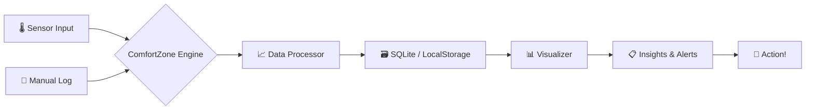

╔══════════════════════════════════════════════════════════════════════════╗
║  ██████  ██████  ███    ███ ███████  ██████  ██████  ████████ ███████  ║
║ ██      ██    ██ ████  ████ ██      ██    ██ ██   ██    ██    ██       ║
║ ██      ██    ██ ██ ████ ██ █████   ██    ██ ██████     ██    █████    ║
║ ██      ██    ██ ██  ██  ██ ██      ██    ██ ██   ██    ██    ██       ║
║  ██████  ██████  ██      ██ ██       ██████  ██   ██    ██    ███████  ║
║  ██████  ██████  ██      ██ ██       ██████  ██   ██    ██    ███████  ║
║ ██      ██    ██ ██      ██ ██      ██    ██ ██   ██    ██         ██  ║
║ ██      ██    ██ ██      ██ ███████ ██    ██ ██████     ██    ███████  ║
╚══════════════════════════════════════════════════════════════════════════╝
                    ░░░░░░░░░░ comfortzone ░░░░░░░░░░
          Personal Comfort Zone Tracker — Python / JavaScript

[](https://github.com/shubhyagami/comfortzone)
[](LICENSE)
[](https://github.com/shubhyagami/comfortzone)

[](https://www.python.org/)
[](https://nodejs.org/)
[](CONTRIBUTING.md)

---

## 🔥 What Is This?

**ComfortZone** is your personal sanctuary of data – a hybrid Python/JS toolkit that tracks, visualises, and nudges you toward your ideal comfort metrics. Whether it's room temperature, ambient noise, humidity, or your subjective mood, ComfortZone turns raw sensor readings into actionable insights. Stop guessing – start thriving.

> “Your comfort zone is not a cage – it’s a dashboard.”

---

## ✨ Features

| Icon | Feature | Description |
|------|---------|-------------|
| 🌡️ | **Temperature Tracking** | Record ambient and skin‑temp from sensors or manual input |
| 😌 | **Mood Logging** | Tag your emotional state alongside physical data |
| 📊 | **Analytics Dashboard** | Real‑time charts & historical trends (matplotlib / Chart.js) |
| 🔔 | **Smart Alerts** | Get pinged when conditions drift outside your sweet spot |
| 🧩 | **Plugin System** | Extend with new sensors or export formats (JSON, CSV, PDF) |
| 🌐 | **Cross‑Platform** | CLI (Python) + Web UI (JS/React) – pick your weapon |

---

## 🧠 How It Works



1. **Input** –

---

## 🚀 Quick Start

Get up and running in 2 minutes:

```bash
# Clone the repo
git clone https://github.com/shubhyagami/comfortzone.git
cd comfortzone

# Python backend
pip install -r requirements.txt
python comfortzone.py --init

# Web UI (optional)
cd web
npm install && npm start
```

Open your browser at `http://localhost:3000` and start tracking your comfort!

---

## 📅 Changelog

### 2026-07-27
- ✨ Added motivational quote generator (turns sensor data into daily affirmations)
- 🐛 Fixed humidity threshold alert not firing on edge cases
- 📈 New dashboard widget: 7‑day comfort score trend

---

## 💡 Pro Tips

- **Pair sensor data with mood logs** – you'll discover that 22°C + 45% humidity is your productivity sweet spot.
- **Use the CLI in cron jobs** to automatically log sensor readings every 15 minutes – no manual effort.
- **Export weekly PDF reports** and share them with your team to optimize office environments.

---

> “Comfort is not a destination – it’s a continuously updating chart.”  
> – The ComfortZone Manifesto