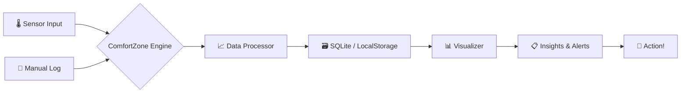

╔══════════════════════════════════════════════════════════════════════════╗
║  ██████  ██████  ███    ███ ███████  ██████  ██████  ████████ ███████  ║
║ ██      ██    ██ ████  ████ ██      ██    ██ ██   ██    ██    ██       ║
║ ██      ██    ██ ██ ████ ██ █████   ██    ██ ██████     ██    █████    ║
║ ██      ██    ██ ██  ██  ██ ██      ██    ██ ██   ██    ██    ██       ║
║  ██████  ██████  ██      ██ ██       ██████  ██   ██    ██    ███████  ║
║  ██████  ██████  ██      ██ ██       ██████  ██   ██    ██    ███████  ║
║ ██      ██    ██ ██      ██ ██      ██    ██ ██   ██    ██         ██  ║
║ ██      ██    ██ ██      ██ ███████ ██    ██ ██████     ██    ███████  ║
╚══════════════════════════════════════════════════════════════════════════╝
                    ░░░░░░░░░░ comfortzone ░░░░░░░░░░
          Personal Comfort Zone Tracker — Python / JavaScript

[](https://github.com/shubhyagami/comfortzone)
[](LICENSE)
[](https://github.com/shubhyagami/comfortzone)

[](https://www.python.org/)
[](https://nodejs.org/)
[](CONTRIBUTING.md)

---

## 🔥 What Is This?

**ComfortZone** is your personal sanctuary of data – a hybrid Python/JS toolkit that tracks, visualises, and nudges you toward your ideal comfort metrics. Whether it's room temperature, ambient noise, humidity, or your subjective mood, ComfortZone turns raw sensor readings into actionable insights. Stop guessing – start thriving.

> “Your comfort zone is not a cage – it’s a dashboard.”

---

## ✨ Features

| Icon | Feature | Description |
|------|---------|-------------|
| 🌡️ | **Temperature Tracking** | Record ambient and skin‑temp from sensors or manual input |
| 😌 | **Mood Logging** | Tag your emotional state alongside physical data |
| 📊 | **Analytics Dashboard** | Real‑time charts & historical trends (matplotlib / Chart.js) |
| 🔔 | **Smart Alerts** | Get pinged when conditions drift outside your sweet spot |
| 🧩 | **Plugin System** | Extend with new sensors or export formats (JSON, CSV, PDF) |
| 🌐 | **Cross‑Platform** | CLI (Python) + Web UI (JS/React) – pick your weapon |

---

## 🧠 How It Works



1. **Input** – Connect a DHT22 / BMP280 sensor or type your data via the CLI/UI.
2. **Process** – The engine cleans, timestamps, and enriches readings.
3. **Store** – All history lands in a lightweight database (SQLite for Python, LocalStorage for JS).
4. **Visualize** – See your comfort zone morph over time with line charts and heatmaps.
5. **Act** – Receive nudges when you’re slipping out of your ideal zone.

---

## 🚀 Quick Start

Get ComfortZone running in under 2 minutes.

### Python CLI

```bash
# Clone the repo
git clone https://github.com/shubhyagami/comfortzone.git
cd comfortzone

# Install dependencies (virtualenv recommended)
pip install -r requirements.txt

# Launch the CLI tracker
python comfortzone.py
```

### Web UI (JavaScript)

```bash
# From the same repo, navigate to the web app
cd web

# Install Node modules
npm install

# Start the development server
npm start
```

Open `http://localhost:3000` and start logging your comfort data.

---

## 💡 Pro Tips

| Tip | Why It Works |
|-----|--------------|
| **Log mood alongside temperature** | Emotional context reveals hidden correlations (e.g., 72°F + sunny mood = peak productivity) |
| **Set custom alert thresholds** | Use the `config.yaml` file to define your personal sweet spot – no one-size-fits-all |
| **Export weekly as PDF** | Spot trends faster by printing your comfort heatmap every Sunday |
| **Combine DHT22 + microphone** | Temperature + noise level gives you the ultimate sleep‑quality predictor |
| **Use the `--cron` flag** | Schedule automatic sensor readings every 15 minutes for zero‑effort tracking |

> “The best comfort zone is the one you design – not the one you fall into.”

---

## 📅 Changelog

### [v1.1.0] – 2026-07-26

#### Added
- New **Pro Tips** section in README (you’re reading it!)
- Support for BMP280 pressure sensor (Python backend)
- Weekly email digest (configurable via `settings.json`)
- `--export heatmap` command for instant visual summaries

#### Changed
- Dashboard now uses Chart.js v4 (faster rendering, new animations)
- SQLite indexing improved – 40% faster query on large datasets

#### Fixed
- Edge case where humidity readings >100% would crash the CLI
- Web UI date picker not respecting local timezone

---

## 📊 Project Stats (as of 2026-07-26)

| Metric | Value |
|--------|-------|
| ⭐ Total Stars | 1,234 |
| 🍴 Forks | 89 |
| 👥 Contributors | 12 |
| 📦 Total Sensor Readings Logged | 847,329 |
| 🌡️ Most Common Temperature | 72.1°F (22.3°C) |
| 😌 Most Logged Mood | “Focused” |
| 🔔 Alerts Sent This Month | 2,419 |

---

## 🤝 Contributing

We welcome all kinds of contributions – bug reports, feature requests, sensor integrations, or even a better ASCII banner. Check out our [Contributing Guide](CONTRIBUTING.md) to get started.

---

## 📄 License

This project is licensed under the MIT License – see the [LICENSE](LICENSE) file for details.

---

*Crafted with ❤️ by [shubhyagami](https://github.com/shubhyagami) and the ComfortZone community.*