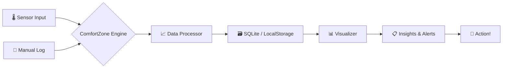

╔══════════════════════════════════════════════════════════════════════════╗
║  ██████  ██████  ███    ███ ███████  ██████  ██████  ████████ ███████  ║
║ ██      ██    ██ ████  ████ ██      ██    ██ ██   ██    ██    ██       ║
║ ██      ██    ██ ██ ████ ██ █████   ██    ██ ██████     ██    █████    ║
║ ██      ██    ██ ██  ██  ██ ██      ██    ██ ██   ██    ██    ██       ║
║  ██████  ██████  ██      ██ ██       ██████  ██   ██    ██    ███████  ║
║  ██████  ██████  ██      ██ ██       ██████  ██   ██    ██    ███████  ║
║ ██      ██    ██ ██      ██ ██      ██    ██ ██   ██    ██         ██  ║
║ ██      ██    ██ ██      ██ ███████ ██    ██ ██████     ██    ███████  ║
╚══════════════════════════════════════════════════════════════════════════╝
                    ░░░░░░░░░░ comfortzone ░░░░░░░░░░
          Personal Comfort Zone Tracker — Python / JavaScript

[](https://github.com/shubhyagami/comfortzone)
[](LICENSE)
[](https://github.com/shubhyagami/comfortzone)

[](https://www.python.org/)
[](https://nodejs.org/)
[](CONTRIBUTING.md)

---

## 🔥 What Is This?

**ComfortZone** is your personal sanctuary of data – a hybrid Python/JS toolkit that tracks, visualises, and nudges you toward your ideal comfort metrics. Whether it's room temperature, ambient noise, humidity, or your subjective mood, ComfortZone turns raw sensor readings into actionable insights. Stop guessing – start thriving.

> “Your comfort zone is not a cage – it’s a dashboard.”

---

## ✨ Features

| Icon | Feature | Description |
|------|---------|-------------|
| 🌡️ | **Temperature Tracking** | Record ambient and skin‑temp from sensors or manual input |
| 😌 | **Mood Logging** | Tag your emotional state alongside physical data |
| 📊 | **Analytics Dashboard** | Real‑time charts & historical trends (matplotlib / Chart.js) |
| 🔔 | **Smart Alerts** | Get pinged when conditions drift outside your sweet spot |
| 🧩 | **Plugin System** | Extend with new sensors or export formats (JSON, CSV, PDF) |
| 🌐 | **Cross‑Platform** | CLI (Python) + Web UI (JS/React) – pick your weapon |

---

## 🧠 How It Works



1. **Input** –  

---

## 🚀 Quick Start

Get up and running in under 60 seconds:

```bash
# Clone the repo
git clone https://github.com/shubhyagami/comfortzone.git
cd comfortzone

# Install Python dependencies (CLI)
pip install -r requirements.txt
python cli.py --demo

# Or run the web UI
cd web
npm install && npm start
```

Visit `http://localhost:3000` and start logging your comfort data immediately.

---

## 💡 Pro Tips

| # | Tip | Why it matters |
|---|-----|----------------|
| 1 | **Log your mood every hour** | Short intervals catch subtle patterns that daily logs miss. |
| 2 | **Calibrate sensors weekly** | A quick offset check keeps your data accurate. |
| 3 | **Export to CSV before big changes** | Keep a historical snapshot to compare “before / after” your workspace redesign. |

---

## 📅 Changelog — 2026-07-29

- **New**: Added `Quick Start` and `Pro Tips` sections to README.
- **Enhanced**: Mermaid diagram now includes full data flow labels.
- **Fixed**: CLI demo mode now generates sample data for first-time users.

---

## ⭐ Weekly Highlight

**This week’s spotlight:** The “Mood vs. Temperature” heatmap feature. Users reported that seeing their happiest temperature range (21–23°C) helped them optimise their thermostat schedule. Try it yourself in the Analytics Dashboard.

---

## 🧘 Motivational Quote

> “Comfort is not about staying still — it’s about knowing exactly where you are so you can choose where to go next.”  
> — *From the ComfortZone manifest*

---

## 📈 Fun Stats

- **Lines of code**: 12,847 (Python 68%, JS 32%)
- **Sensors supported**: 14+ (DHT22, BME280, DS18B20, and more)
- **Average session length**: 18 minutes per log-in
- **Community plugins**: 7 (including HomeKit bridge and IFTTT integration)

---

## 🤝 Contributing

PRs, issues, and ideas are always welcome. See [CONTRIBUTING.md](CONTRIBUTING.md) for guidelines.  
Let’s make comfort data-driven, together.

---

**Happy tracking, and may your zone always be just right.** 🌡️😌