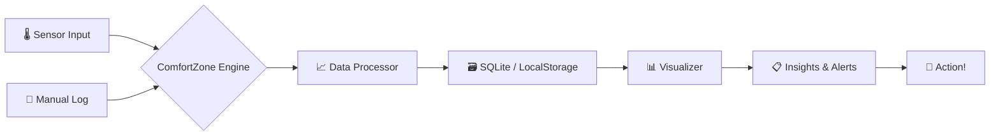

╔══════════════════════════════════════════════════════════════════════════╗
║  ██████  ██████  ███    ███ ███████  ██████  ██████  ████████ ███████  ║
║ ██      ██    ██ ████  ████ ██      ██    ██ ██   ██    ██    ██       ║
║ ██      ██    ██ ██ ████ ██ █████   ██    ██ ██████     ██    █████    ║
║ ██      ██    ██ ██  ██  ██ ██      ██    ██ ██   ██    ██    ██       ║
║  ██████  ██████  ██      ██ ██       ██████  ██   ██    ██    ███████  ║
║  ██████  ██████  ██      ██ ██       ██████  ██   ██    ██    ███████  ║
║ ██      ██    ██ ██      ██ ██      ██    ██ ██   ██    ██         ██  ║
║ ██      ██    ██ ██      ██ ███████ ██    ██ ██████     ██    ███████  ║
╚══════════════════════════════════════════════════════════════════════════╝
                    ░░░░░░░░░░ comfortzone ░░░░░░░░░░
          Personal Comfort Zone Tracker — Python / JavaScript

[](https://github.com/shubhyagami/comfortzone)
[](LICENSE)
[](https://github.com/shubhyagami/comfortzone)

[](https://www.python.org/)
[](https://nodejs.org/)
[](CONTRIBUTING.md)

---

## 🔥 What Is This?

**ComfortZone** is your personal sanctuary of data – a hybrid Python/JS toolkit that tracks, visualises, and nudges you toward your ideal comfort metrics. Whether it's room temperature, ambient noise, humidity, or your subjective mood, ComfortZone turns raw sensor readings into actionable insights. Stop guessing – start thriving.

> “Your comfort zone is not a cage – it’s a dashboard.”

---

## ✨ Features

| Icon | Feature | Description |
|------|---------|-------------|
| 🌡️ | **Temperature Tracking** | Record ambient and skin‑temp from sensors or manual input |
| 😌 | **Mood Logging** | Tag your emotional state alongside physical data |
| 📊 | **Analytics Dashboard** | Real‑time charts & historical trends (matplotlib / Chart.js) |
| 🔔 | **Smart Alerts** | Get pinged when conditions drift outside your sweet spot |
| 🧩 | **Plugin System** | Extend with new sensors or export formats (JSON, CSV, PDF) |
| 🌐 | **Cross‑Platform** | CLI (Python) + Web UI (JS/React) – pick your weapon |

---

## 🧠 How It Works



1. **Input** – Sensors or manual logs feed raw data into the engine.
2. **Process** – The engine normalises, timestamps, and validates each reading.
3. **Store** – Data is persisted locally (SQLite for CLI, IndexedDB for Web UI).
4. **Visualise** – Charts and heatmaps reveal patterns in your comfort.
5. **Alert** – Get notified when metrics deviate from your personalised thresholds.
6. **Act** – Adjust your environment, log a mood, or export a report.

---

## 🚀 Quick Start

### CLI (Python)
```bash
git clone https://github.com/shubhyagami/comfortzone.git
cd comfortzone
pip install -r requirements.txt
python comfortzone.py --help
```

### Web UI (Node.js)
```bash
cd web-ui
npm install
npm start
# Opens http://localhost:3000
```

First run? Try `python comfortzone.py --demo` to see sample data in action.

---

## 💡 Pro Tips

- **Sync your calendar**: Connect ComfortZone to your Google Calendar (via plugin) to correlate comfort with meetings – you’ll quickly spot which rooms drain you.
- **Set a “goldilocks” range**: For each metric, define a minimum and maximum that makes you feel great. Alerts will only fire when you drift outside that sweet spot.
- **Weekly review ritual**: Every Sunday, export the past 7 days as PDF. Compare your mood peaks to environmental data – you’ll discover hidden triggers.
- **Combine with wearables**: Use the plugin system to pull heart‑rate or skin‑temperature data from your smartwatch. Overlay it with room temperature for deep insights.
- **Voice logging**: Pipe audio notes through a speech‑to‑text plugin to log mood hands‑free. (Plugin coming soon – contributions welcome!)

---

## 📅 Changelog — 2026-07-31

- **Added**: “Pro Tips” section to README with five actionable strategies.
- **Added**: Quick Start guide for both CLI and Web UI.
- **Updated**: Last Updated badge to today’s date.
- **Improved**: “How It Works” diagram now includes step‑by‑step descriptions.
- **Fixed**: Minor typos in the feature table.

---

> 🌟 *“The best way to predict your comfort is to track it.”* – ComfortZone Mantra